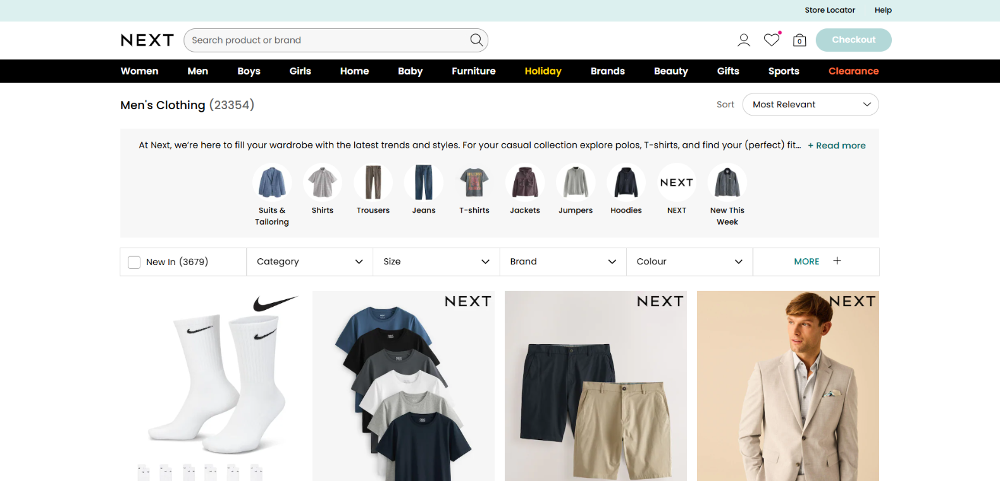

# 🌐 Next Website - Automation Testing Project 💻


🛠️ This project is a work in progress. More tests and improvements coming soon!


⭐ Automated testing project for the real shopping site [Next.co.uk](https://www.next.co.uk/) 🛒 ⭐

<iframe scrolling='no' frameborder='0' style='width: 1902px; height: 1070px; border:0;' src='https://app.screencast.com/9JWRA6SuiPkIR/e' allowfullscreen></iframe>

<p>
  
</p>

## 📑 Technologies & Skills & Features
| Technologies      | Description |
| ----------- | ----------- |
| **Python:**      | The project is developed using Python, providing a robust and widely used programming language for automation.       |
| **PyTest:**   | PyTest is used as the testing framework, offering powerful test configuration options, parallel execution, and detailed reporting.        |
| **Playwright:**   | The project uses Playwright for automating browser interactions.        |
| **Page Object Model (POM):**   | The project follows the POM design pattern, enhancing test maintainability and reusability by separating page elements and actions.        |
| **Allure Reports:**   | Test results are documented using Allure Reports, providing a clear and interactive visualization of test execution.        |

    
## ✅ Test Coverage
- Home Page functionality
- Login flow
- Registration flow
- Product search
- Header navigation
- Sorting and filtering on search results


## 🚀 Getting Started
1. **Clone the Repository:**
   ```bash
   git clone https://github.com/guyltech/Next-Automation.git
    ```


## 📁 Project Structure
```
project_root/
│
├── pages/
│   ├── __init__.py
│   ├── base_page.py
│   ├── home_page.py
│   ├── login_page.py
│   ├── registration_page.py
│   ├── search_results_page.py
│   ├── sub_category_page.py
│   └── components/
│       ├── __init__.py
│       └── common_dialogs.py
│
├── tests/
│   ├── __init__.py
│   ├── base_test.py
│   ├── conftest.py
│   ├── test_header_navigation.py
│   ├── test_login.py
│   ├── test_product_search.py
│   ├── test_registration.py
│   └── test_sorting_and_filtering.py
│
├── pytest.ini
├── requirements.txt
└── README.md
```

## Built with ❤️ by Guy Levy
